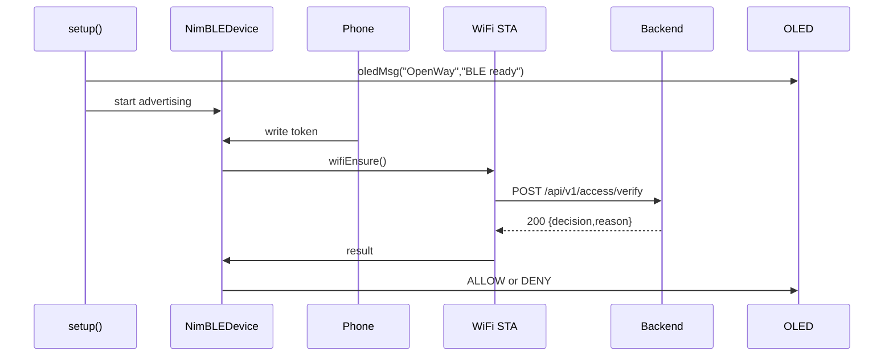

# ESP Snapshot — 2025-10-17, commit e8dcd7f (dirty)

## PlatformIO & Envs
- platformio.ini: bluetooth_android_esp32/platformio.ini:1-14
  - env: `env:esp32dev` (1)
  - platform: espressif32 (2)
  - board: esp32dev (3)
  - framework: arduino (4)
  - monitor_speed: 115200 (5)
  - lib_deps: NimBLE-Arduino, Adafruit SSD1306, Adafruit GFX (7-11)
  - build_flags: -DCORE_DEBUG_LEVEL=1 (12-13)

## Архитектура прошивки
- Главный файл: bluetooth_android_esp32/src/main.cpp
- Роли:
  - BLE GATT peripheral: принимает токен через характеристику и инициирует проверку
  - Wi-Fi on-demand: включается для HTTP, затем отключается
  - OLED: отображение статусов (READY/ALLOW/DENY/сообщения)
- Последовательность (mermaid):

## Потоки/Логика
- Инициализация:
  - Serial.begin(115200) — bluetooth_android_esp32/src/main.cpp:105-106
  - OLED I2C (SDA=21, SCL=22), адрес 0x3C/0x3D fallback — bluetooth_android_esp32/src/main.cpp:20-28,108-113
  - BLE: имя "OpenWay ESP32"; Service UUID `4fafc201-...`; Char UUID `beb5483e-...`; свойства WRITE/WRITE_NR — bluetooth_android_esp32/src/main.cpp:31-34,115-123,118-120
  - Таймеры/задачи: отсутствуют; `loop()` лишь `delay(500)` — bluetooth_android_esp32/src/main.cpp:128
- Константы URL/таймаутов:
  - HOST/PORT/PATH: BACKEND_HOST, BACKEND_PORT, VERIFY_PATH — bluetooth_android_esp32/src/main.cpp:13-16
  - TIMEOUT: HTTP_TIMEOUT_MS=5000 — bluetooth_android_esp32/src/main.cpp:17
  - GATE_ID="GATE-01" — bluetooth_android_esp32/src/main.cpp:16
- Алгоритм запросов:
  - Формирование URL: `http://<HOST>:<PORT>/api/v1/access/verify` — bluetooth_android_esp32/src/main.cpp:66
  - Тело JSON: `{gate_id, token}` — bluetooth_android_esp32/src/main.cpp:67
  - Заголовок: Content-Type: application/json — bluetooth_android_esp32/src/main.cpp:71
  - Таймаут HTTP: 5000ms — bluetooth_android_esp32/src/main.cpp:69
  - Ожидаемый ответ: 200 и подстрока `"decision":"ALLOW"` — bluetooth_android_esp32/src/main.cpp:79-80
  - Логи: URL, код, тело — bluetooth_android_esp32/src/main.cpp:76-77
- Обработка ошибок/ретраи:
  - Wi-Fi подключение ждёт до ~12s, затем false — bluetooth_android_esp32/src/main.cpp:49-55
  - При сбоях: логи `[WiFi] connect fail`, `[HTTP] begin fail` — bluetooth_android_esp32/src/main.cpp:64-70
  - После запроса Wi-Fi выключается (освобождаем радио) — bluetooth_android_esp32/src/main.cpp:77-78
  - Throttle/rate-limit явных ограничений в прошивке нет (проверено по коду)

## Дисплей
- API: `Adafruit_SSD1306` + `Adafruit_GFX`; функции: `oledMsg(l1, l2)` — bluetooth_android_esp32/src/main.cpp:22-29
- Строки состояния:
  - На старте: "OpenWay" / "BLE ready" — bluetooth_android_esp32/src/main.cpp:113-114
  - Готов: "READY" / "Write token" — bluetooth_android_esp32/src/main.cpp:125-126,100-101
  - Верификация: "VERIFY" / "Sending..." — bluetooth_android_esp32/src/main.cpp:87-88
  - ALLOW: "ALLOW" / "Gate GATE-01" (+ зелёный LED) — bluetooth_android_esp32/src/main.cpp:90-94
  - DENY: "DENY" / "Bad token/perm" (+ мигание красным) — bluetooth_android_esp32/src/main.cpp:96-101
- Обновление: ручной вызов display.display() внутри `oledMsg` — bluetooth_android_esp32/src/main.cpp:23-29

## Безопасность/секреты
- Wi-Fi SSID/PASS захардкожены: `WIFI_SSID`, `WIFI_PASS` — bluetooth_android_esp32/src/main.cpp:11-12 (значения скрывать при публикации)
- BACKEND_HOST/PORT/GATE_ID захардкожены — bluetooth_android_esp32/src/main.cpp:13-16
- TLS/пиннинг не используется; HTTP по нешифрованному `http://` — bluetooth_android_esp32/src/main.cpp:66

## Сборка
- Проверка инструментов: `pio --version` — FAIL: `(eval):1: command not found: pio`
- Сборка не выполнялась из-за отсутствия PlatformIO CLI в окружении.

## Гэп-анализ и TODO
- Секреты и адреса зашиты в код — перенести в `secrets.h`/env или `platformio.ini` extra configs.
- Нет health-пинга/автоповторов/экспоненциального backoff; нет обработки причин DENY (reason) — сейчас парсится только ALLOW подстрокой.
- Нет ограничений частоты запросов на устройстве; возможен спам при частых BLE write.
- Нет HTTPS/TLS и проверки сертификата — трафик в открытом виде.
- BLE write принимает произвольную длину/формат — добавить валидацию/token length.
