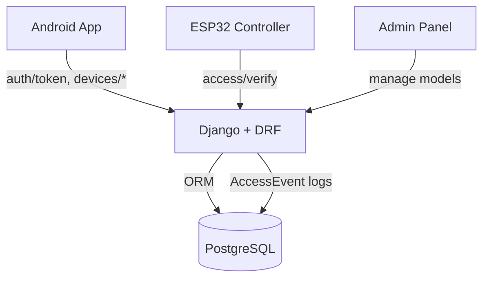

# Отчёт по аудиту OpenWay Access

## 1. Обзор репозитория
- **Корень**
  - `backend/` — Django/DRF backend (Python 3.12, Django 5.0.6, DRF 3.15.2).
    - `accessproj/` — проект и настройки (`settings/{base,dev,prod,test}.py`, wsgi/asgi).
    - `apps/` — бизнес-приложения (`devices`, `access`, `accounts`, `api`).
    - `compose.yml` — dev Docker Compose (web + PostgreSQL).
    - `scripts/` — `entrypoint.sh`, `wait-for-db.sh`.
    - `tests/` — API тесты (Django TestCase + DRF APIClient).
  - `android/OpenWay/` — Android приложение (Gradle, Kotlin, Jetpack Compose).
  - `firmware/` — прошивка ESP32 (PlatformIO, C++ `src/main.cpp`).
  - `docs/` — API, протоколы, Wi-Fi поток, runbook.
  - `infra/` — альтернативный docker-compose (legacy, не в синхронизации).
- **Точки входа**: `backend/manage.py`, `accessproj/wsgi.py`, `accessproj/asgi.py`, Dockerfile (`python:3.12-slim`), `backend/compose.yml` (порт 8001→8000).
- **Версии и инструменты**: Python 3.12, Django 5.0.6, DRF 3.15.2, PostgreSQL 16, Gunicorn (prod), DRF Token Auth.
- **Готовые конфиги**: `pyproject.toml` (black/isort), `ruff.toml`, `mypy.ini`, `pytest.ini`, `coverage.ini`, `Makefile`, `.github/workflows/ci.yml`.

## 2. Сборка и запуск
- **Dev (Docker)**
  ```bash
  cp .env.example .env
  make up
  docker compose -f backend/compose.yml --env-file .env exec web python manage.py migrate --noinput
  ```
- **Dev (локально)**
  ```bash
  make venv
  make deps  # требует доступ к PyPI
  cp .env.example .env
  make migrate DJANGO_SETTINGS=accessproj.settings.dev
  make runserver
  ```
- **Тесты + coverage**
  ```bash
  make test  # внутри вызывает coverage run + coverage.xml
  ```
  ⚠️ Тесты не запущены: изолированная среда не позволяет установить зависимости PyPI (`ModuleNotFoundError: No module named 'django'`).
- **Docker Compose проверка**: `docker compose -f backend/compose.yml config` требует `.env`; шаблон обновлён, `env_file` теперь указывает на корневой `.env`.
- **Баг конфигурации**: `backend/scripts/entrypoint.sh:5` теперь уважает `DJANGO_SETTINGS_MODULE`; ранее переменная всегда переопределялась.

## 3. Окружение
Актуальный шаблон `.env.example` (корень).

| ENV | Где читается | Значение по умолчанию | Обязательность |
| --- | --- | --- | --- |
| `DJANGO_SECRET_KEY` | `backend/accessproj/settings/base.py:5` | `dev-secret` | ✅ прод: требуется вынести в секреты |
| `DJANGO_SETTINGS_MODULE` | manage.py, wsgi/asgi, `scripts/entrypoint.sh:5` | `accessproj.settings.dev` | ♻️ переопределять для prod/test |
| `DJANGO_ALLOWED_HOSTS` | `backend/accessproj/settings/base.py:7` | `*` | ✅ прод: ограничить списком |
| `POSTGRES_DB` | `backend/accessproj/settings/base.py:56`, compose | `nfc_access` | ✅ |
| `POSTGRES_USER` | `backend/accessproj/settings/base.py:57`, compose | `nfc` | ✅ |
| `POSTGRES_PASSWORD` | `backend/accessproj/settings/base.py:58`, compose | `nfc` | ✅ |
| `DB_HOST` | `backend/accessproj/settings/base.py:59`, `scripts/wait-for-db.sh:5` | `db` | ♻️ локально заменить на `localhost` |
| `DB_PORT` | `backend/accessproj/settings/base.py:60` | `5432` | ♻️ |
| `ACCESS_VERIFY_RATE` | `backend/accessproj/settings/base.py:98` | `30/second` | ♻️ подобрать под нагрузку |
| `LOG_LEVEL` | предлагается для logging config | `INFO` | ☐ |
| `REQUEST_ID_HEADER` | предлагается для middleware | `X-Request-ID` | ☐ |

Несоответствия: `backend/.env.example` признан устаревшим (оставлен stub). `infra/docker-compose.yml` по-прежнему ожидает `backend/.env` и требует синхронизации.

## 4. Архитектура и схема данных


**Модели и связи**
- `devices.Device` (`backend/apps/devices/models.py:6`): FK → User, поля `auth_token` (unique, char64), `android_device_id`, `totp_secret`, `is_active`, `created_at`.
- `access.AccessPoint` (`backend/apps/access/models.py:5`): уникальный код ворот.
- `access.AccessPermission` (`backend/apps/access/models.py:13`): FK → `AccessPoint`, `User` (nullable), `Group` (nullable), `allow`; `unique_together` плохо работает с NULL.
- `access.AccessEvent` (`backend/apps/access/models.py:22`): FK → `AccessPoint` и `User`, `device_id` (int, нет FK), `decision`, `reason`, `raw` JSON, `created_at`.
- `accounts.PasswordHistory` (`backend/apps/accounts/models.py:7`): FK → User, хранит хеши прошлых паролей.

**Риски миграций**
- `AccessPermission` — `unique_together` с `NULL` не обеспечивает уникальность (дубликаты user/group). Требуется новый `UniqueConstraint` (см. `patches/0001-access-permission-unique.patch`).
- `AccessEvent.device_id` — тип `IntegerField` (без FK) → отсутствует ссылочная целостность, возможны «битые» записи; миграция на FK с `SET_NULL`.
- Отсутствует индекс по `auth_token` (покрывается уникальностью, ок) и `AccessEvent.created_at` (для аналитики стоит добавить).
- `Device.android_device_id` nullable без уникальности — возможно несколько активных устройств на один ID; уточнить бизнес-правила.

## 5. API
- Ключевые эндпоинты
  - `POST /api/v1/auth/token` — тело `{username, password}`, ответ `{token}`. Используется DRF TokenAuth.
  - `POST /api/v1/devices/register` — `{android_device_id?, rotate?}` → `{device_id, token, qr_payload}`. Требует `Authorization: Token <api_token>`.
  - `GET /api/v1/devices/me` — массив устройств `{id, android_device_id, is_active, token_preview}`.
  - `POST /api/v1/devices/revoke` — `{device_id? | android_device_id?}` → `{device_id, is_active}`. 404 при отсутствии устройcтва.
  - `POST /api/v1/access/verify` — `{gate_id, token}` → `{decision, reason, duration_ms?}`. Всегда 200 OK.
- Примеры
  ```bash
  http POST :8001/api/v1/auth/token username=demo password=StrongPass_123
  http POST :8001/api/v1/devices/register Authorization:"Token <api_token>" rotate:=true android_device_id="pixel-7"
  http GET  :8001/api/v1/devices/me Authorization:"Token <api_token>"
  http POST :8001/api/v1/devices/revoke Authorization:"Token <api_token>" device_id:=42
  http POST :8001/api/v1/access/verify gate_id=gate-01 token=deadbeef
  ```
- Ошибки `/api/v1/access/verify`
  - `decision=DENY`, `reason=TOKEN_INVALID` — не найден токен.
  - `DENY/DEVICE_INACTIVE` — устройство выключено.
  - `DENY/NO_PERMISSION` — нет AccessPermission.
  - `DENY/UNKNOWN_GATE` — нет AccessPoint.
  - `DENY/INVALID_REQUEST` — сериализатор не прошёл валидацию.
  - `DENY/RATE_LIMIT` — сработал ScopedRateThrottle (`ACCESS_VERIFY_RATE`).
- Спецификация: `docs/openapi.yaml` (OpenAPI 3.1). Содержит схемы запросов/ответов и security scheme TokenAuth.

## 6. Готовность к интеграции Android/ESP32
| Контур | Статус | Комментарий |
| --- | --- | --- |
| Аутентификация пользователя (`/auth/token`) | ✅ готово | Используется DRF TokenAuth, покрыто тестами.
| Регистрация устройства (`/devices/register`) | ✅ готово | Есть ротация токена, поддержка `android_device_id`.
| Получение токена приложением | ♻️ частично | Токен статичный, отсутствуют nonce/ttl и сигнатуры.
| Передача контроллеру (`/access/verify`) | ♻️ частично | Endpoint доступен, но нет Wi-Fi контракта и анти-replay.
| ESP32 ↔ backend Wi-Fi | ☐ нет | Требуется отдельный маршрут или расширение запроса полями `nonce`, `transport`.
| Логи и метрики проходов | ♻️ частично | `AccessEvent` пишет сырой JSON, но нет структурированных логов/метрик.

MVP-предложения описаны в `docs/wifi_token_flow.md` (sequenceDiagram + чек-листы).

## 7. Security & QA
- **P0** `DJANGO_SECRET_KEY` и `DJANGO_ALLOWED_HOSTS='*'` в prod (`backend/accessproj/settings/base.py:5-7`). Нужно сделать обязательными и внедрить в CI проверку.
- **P0** Static token без nonce/TTL (`backend/apps/api/v1/views.py:149`) → уязвимость к replay. Необходима одноразовость или HMAC.
- **P1** `AccessPermission` уникальность (`backend/apps/access/models.py:20`) нарушается при `NULL` → риск ошибочного доступа.
- **P1** `AccessEvent.device_id` без FK (`backend/apps/access/models.py:25`) — теряется целостность, трудно коррелировать события.
- **P1** REST_FRAMEWORK default `AllowAny` (`backend/accessproj/settings/base.py:89`); rely on view-level auth. Рассмотреть `IsAuthenticated` по умолчанию и явные исключения.
- **P1** Нет CORS/CSRF политики — потребуется Whitelist для Android/Web.
- **P2** Нет HTTPS/прокси-настроек кроме `SECURE_*` в prod; добавить HSTS, SSL redirect.
- **P2** Отсутствует statick analysis run (ruff/bandit) из-за зависимости от offline среды; команды заданы в `Makefile` и CI.
- **P2** Нет проверок уникальности `android_device_id` → возможны конфликтующие устройства на один ID.
- **P3** `infra/docker-compose.yml` устарел и расходится с реальным окружением.

## 8. Observability
- **Что есть:** стандартные Django логи (plain text), `AccessEvent` хранит решение и `raw` payload, `/health` без проверки БД.
- **Что нужно добавить:**
  - JSON-логирование с `LOG_LEVEL` и `REQUEST_ID_HEADER` (`structlog`/`python-json-logger`).
  - Middleware для Request ID + проброс в `AccessEvent.raw`.
  - Экспорт метрик: количество verify, доля ALLOW/DENY, latency (`django-prometheus` или custom StatsD).
  - Health-check БД/кэша (`/healthz` с `connection.ensure_connection()`).
  - Алерты на рост `RATE_LIMIT` и количество deny по причинам.

## 9. Performance
- Сценарий `perf/k6_verify.js`: burst (до 80 rps) + steady (20 rps, 2 минуты). Настраивается переменными `BASE_URL`, `GATE_ID`, `DEVICE_TOKEN`.
- Рекомендованные SLO: `p95` < 300 мс, `error-rate` < 1%. При превышении — анализировать throttling и скорость поиска токена (рассмотреть кэш/Redis).
- Интерпретация: мониторим долю `RATE_LIMIT`, latency по `access_verify`, загрузку Postgres (индекс по `auth_token` и `AccessEvent.created_at`).

## 10. DX
- Обновлённый `Makefile`: `make venv`, `make deps`, `make runserver`, `make test`, `make lint`, `make fmt`, `make up/down`, `make loadtest`.
- Конфиги форматирования/линтов: `pyproject.toml`, `ruff.toml`, `mypy.ini`, `pytest.ini`, `coverage.ini`.
- Dev зависимости: `backend/requirements-dev.txt` (ruff, black, isort, mypy, bandit, pip-audit, pytest, coverage).
- Команда «с нуля до запроса»: `make up` → `make migrate` → `http POST .../auth/token` → `http POST .../devices/register` → `http POST .../access/verify`.

## 11. CI/CD
- GitHub Actions `.github/workflows/ci.yml`:
  1. **lint** — устанавливает зависимости, запускает `make lint`.
  2. **test** (после lint) — `pytest --collect-only` + `make test`, артефакт `coverage.xml`.
  3. **docker-build** — собирает образ `backend/Dockerfile`.
- Просмотр логов: вкладка Actions → job → steps. Coverage загружается как artifact.

## 12. Документация
- Добавлено/обновлено: `README.md`, `docs/openapi.yaml`, `docs/wifi_token_flow.md`, `docs/RUNBOOK.md`, `REPORT.md`, `ISSUES_TODO.md`, `perf/k6_verify.js`.
- Остаётся сделать: описать обновлённый `infra/docker-compose.yml`, добавить user journey для Android, автоматизировать генерацию OpenAPI (через DRF schema view), документировать миграцию Wi-Fi (roadmap в wiki).

## 13. Резюме аудита
- **Топ-10 рисков (P0/P1)**
  1. P0 — Статический device token без nonce/TTL (replay уязвимость).
  2. P0 — Продакшен запускается с `dev-secret` и `ALLOWED_HOSTS='*'`.
  3. P1 — Уникальность AccessPermission не гарантирована для NULL → риск некорректных прав.
  4. P1 — AccessEvent не связан FK с устройством → потеря трассировки.
  5. P1 — Отсутствует Wi-Fi контракт/эндпоинт, нет throttle разделения.
  6. P1 — Нет структурированных логов и request-id.
  7. P1 — Нет политики CORS/CSRF для мобильного клиента.
  8. P1 — Финтроллинг токена хранится в открытом виде, нет шифрования при передаче на ESP32.
  9. P1 — `infra/docker-compose.yml` рассинхронизирован с основным окружением.
  10. P1 — Лимиты и метрики verify не мониторятся (нет SLO/SLA трекинга).

- **План на 1–2 дня (quick wins)**
  1. Ввести обязательные `DJANGO_SECRET_KEY`/`DJANGO_ALLOWED_HOSTS` + секреты в окружениях.
  2. Принять патч на уникальность AccessPermission (`patches/0001-access-permission-unique.patch`) и добавить FK для `AccessEvent.device`.
  3. Настроить JSON-логирование + Request ID middleware, включить вывод `gate_id/device_id`.
  4. Запустить линты/тесты в среде с доступом к PyPI, зафиксировать coverage.

- **План на 1–2 недели**
  1. Спроектировать и внедрить Wi-Fi контракт: nonce, ttl, подпись, расширенный endpoint (`verify/wifi`).
  2. Добавить Redis (или другую in-memory storage) для хранения одноразовых токенов/nonce.
  3. Расширить мониторинг: Prometheus/Grafana, алерты на decision reason, интеграция с k6 pipeline.
  4. Подготовить Android/ESP32 SDK слои (HTTP клиент + retry + конфигурация), обновить документацию и CI для firmware.
  5. Провести security review (OWASP API checklist) и dependency audit (pip-audit) с фиксом уязвимых пакетов.

