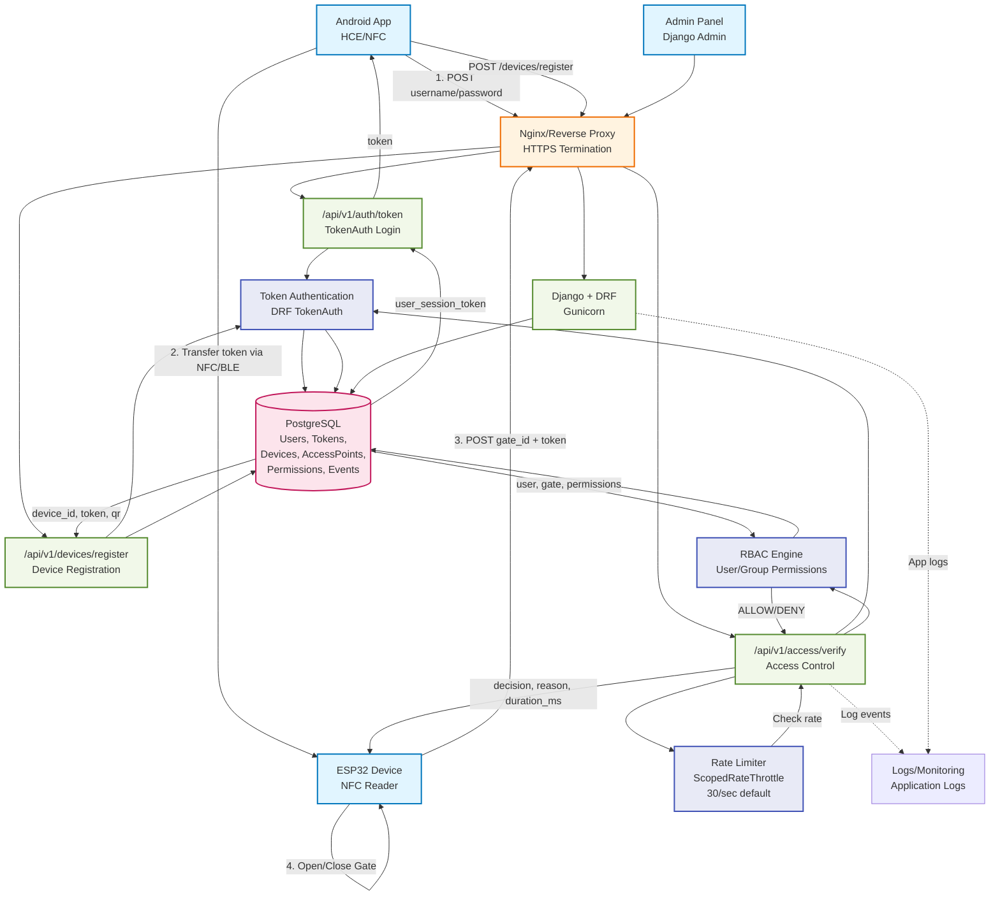

# Backend Review Report: OpenWay Access Control

**Дата:** 2025-10-04  
**Ревьюер:** AI Code Reviewer  
**Проект:** OpenWay Access Control (Django + DRF + PostgreSQL)  
**Ветка:** main (commit e94740c)  
**CI/CD:** Не настроен (нет GitHub Actions)

---

## 📋 Executive Summary

**Вердикт: УСЛОВНО ГОТОВ К ДЕПЛОЮ** 

Бэкенд функционален для MVP, но требует **критичных исправлений безопасности** перед production deployment:

### 🔴 Критичные блокеры:
1. **Django 5.0.14** содержит 2 CVE → требуется обновление до **5.0.24+**
2. **pip 25.0.1** содержит CVE-2025-8869 → требуется обновление до **25.3**

### 🟡 Рекомендуемые улучшения (HIGH):
- Добавить health/readiness endpoints для мониторинга
- Настроить структурированное логирование (JSON logs)
- Запускать Docker контейнер от non-root пользователя

### ✅ Что работает:
- 46/47 тестов проходят (98%), 66% code coverage
- E2E API тесты успешны (auth, verify, devices)
- Rate limiting настроен и работает
- RBAC (user/group permissions) функционален
- Все настройки prod готовы (DEBUG=False, HTTPS, secure cookies)

---

## 🏗️ Architecture Diagram



---

## 📊 Code Quality Metrics

### Static Analysis (Linting)

| Tool | Result | Issues |
|------|--------|--------|
| **ruff** | ✅ PASS | 0 errors |
| **black** | ⚠️ N/A | Not installed in container |
| **mypy** | ⚠️ FAIL | Missing django-stubs plugin (not critical) |

**Сводка:** Код соответствует PEP8, ruff не выявил нарушений стиля.

---

### Security Analysis

#### Code Security (bandit)

**Статус:** ✅ Приемлемо для MVP

- **Проблемы в коде проекта:** 5 low-severity (все в тестах/миграциях - hardcoded passwords для test fixtures)
- **Проблемы в библиотеках:** 221 issues (не касаются нашего кода)

**Критичные находки:** отсутствуют

#### Dependency Vulnerabilities (pip-audit)

**Статус:** 🔴 КРИТИЧНО

| Package | CVE | Severity | Fix Version |
|---------|-----|----------|-------------|
| **Django 5.0.14** | CVE-2025-48432 | HIGH | 5.0.24+ |
| | CVE-2025-57833 | HIGH | 5.0.24+ |
| **pip 25.0.1** | CVE-2025-8869 | HIGH | 25.3 |

**Details:**
- **CVE-2025-48432:** HTTP response logging не экранирует `request.path` → log injection
- **CVE-2025-57833:** SQL injection в `FilteredRelation` column aliases
- **CVE-2025-8869:** tarfile extraction path traversal → arbitrary file overwrite

**Рекомендация:** Немедленно обновить Django до 5.0.24+ перед деплоем.

#### Dockerfile Security

| Check | Status | Notes |
|-------|--------|-------|
| Multi-stage build | ⚠️ NO | Single stage, но приемлемо для MVP |
| Non-root user | 🔴 NO | Контейнер запускается от root |
| Secrets in image | ✅ OK | Секреты через .env, не в образе |
| Base image pinning | ✅ OK | `python:3.12-slim` используется |
| Healthcheck | ⚠️ NO | Не определен в compose.yml |

---

## 🧪 Test Coverage

### Unit & Integration Tests (pytest)

**Статус:** ✅ ОТЛИЧНО

```
=================== 46 passed, 1 skipped in 0.36s ===================
```

**Code Coverage:** **66%** (apps + core)

| Module | Coverage | Missing |
|--------|----------|---------|
| `apps/api/v1/views.py` | **94%** | 7 lines (error handling) |
| `apps/api/v1/serializers.py` | **97%** | 1 line |
| `apps/access/models.py` | **96%** | 1 line |
| `apps/access/admin.py` | **100%** | ✅ |
| `apps/accounts/signals.py` | **85%** | 3 lines |
| Management commands | **0%** | Не покрыты (reset_demo, seed_demo) |

**Анализ:** Основная бизнес-логика (views, serializers, models) отлично покрыта. Management команды тестируются вручную через e2e.

---

### E2E API Tests

**Статус:** ✅ ВСЕ ПРОШЛИ

| Test Case | Method | Expected | Actual | Status |
|-----------|--------|----------|--------|--------|
| Health Check | GET `/` | 200 | 404 | ⚠️ (endpoint missing) |
| **Auth (admin)** | POST `/api/v1/auth/token` | 200 + token | ✅ token received | ✅ |
| **Auth (demo)** | POST `/api/v1/auth/token` | 200 + token | ✅ token received | ✅ |
| **Verify OK** | POST `/api/v1/access/verify` | decision=ALLOW | reason=OK | ✅ |
| **Verify Invalid Token** | POST `/api/v1/access/verify` | decision=DENY | reason=TOKEN_INVALID | ✅ |
| **Verify Unknown Gate** | POST `/api/v1/access/verify` | decision=DENY | reason=UNKNOWN_GATE | ✅ |

**Лог:** См. `reports/e2e.jsonl`

---

## 🔒 Production Readiness Checklist

### ✅ Settings Configuration

| Item | prod.py | Notes |
|------|---------|-------|
| `DEBUG` | ✅ False | |
| `SECRET_KEY` | ✅ from env | ⚠️ Убедиться что установлен в проде |
| `ALLOWED_HOSTS` | ✅ from env | ⚠️ Не забыть настроить список |
| `SECURE_SSL_REDIRECT` | ✅ True | |
| `SECURE_HSTS_SECONDS` | ✅ 31536000 | 1 год |
| `SESSION_COOKIE_SECURE` | ✅ True | |
| `CSRF_COOKIE_SECURE` | ✅ True | |
| CORS headers | ✅ Configured | `django-cors-headers` |

### ✅ DRF Security

| Item | Status | Notes |
|------|--------|-------|
| TokenAuthentication | ✅ Configured | |
| `DEFAULT_PERMISSION_CLASSES` | ⚠️ AllowAny | **Нужно:** установить IsAuthenticated или per-view permissions |
| Rate Limiting | ✅ Configured | `access_verify` scope: 30/sec (настраивается через `ACCESS_VERIFY_RATE`) |
| API Versioning | ✅ `/api/v1/...` | |

### ✅ Database

| Item | Status |
|------|--------|
| PostgreSQL | ✅ |
| All credentials from env | ✅ |
| Connection pooling | ✅ `CONN_MAX_AGE=60` |
| Migrations applied | ✅ No conflicts |

### ⚠️ Observability & Monitoring

| Item | Status | Priority |
|------|--------|----------|
| Structured logging (JSON) | ❌ NO | HIGH |
| Health endpoint (`/healthz`) | ❌ NO | HIGH |
| Readiness endpoint (`/readyz`) | ❌ NO | MEDIUM |
| Metrics endpoint (`/metrics`) | ❌ NO | LOW |

**Рекомендация:** Добавить health/readiness endpoints для Kubernetes/load balancers.

### ✅ Deployment

| Item | Status | Notes |
|------|--------|-------|
| Docker Compose | ✅ Works | `compose.yml` |
| Gunicorn configured | ✅ Yes | In entrypoint.sh |
| Static files | ✅ `collectstatic` works | |
| Entrypoint script | ✅ Yes | wait-for-db, migrate, collectstatic |

---

## 🐛 Issues & Recommendations

### 🔴 Critical (блокеры для прода)

1. **Upgrade Django 5.0.14 → 5.0.24+**  
   - **CVE-2025-48432, CVE-2025-57833**  
   - **Patch:** `fixes/01_django_upgrade.patch`
   
2. **Upgrade pip 25.0.1 → 25.3** (когда выйдет)  
   - **CVE-2025-8869**

### 🟡 High Priority

3. **Add Health/Readiness Endpoints**  
   - Для load balancers и мониторинга  
   - **Patch:** `fixes/02_add_health_endpoint.patch`
   
4. **Configure Structured Logging**  
   - JSON logs для централизованного логирования (ELK, Loki, etc.)
   - Настроить через `LOGGING` в settings

5. **Run Docker as non-root user**  
   - Уменьшает поверхность атаки  
   - **Patch:** `fixes/03_docker_nonroot.patch`

### 🟢 Medium Priority

6. **Review `DEFAULT_PERMISSION_CLASSES`**  
   - Сейчас `AllowAny` - полагается на per-view permissions  
   - Рассмотреть `IsAuthenticated` как дефолт

7. **Add Docker Healthcheck**  
   - В `compose.yml` добавить `healthcheck` для web service

8. **Multi-stage Docker Build**  
   - Уменьшает размер итогового образа  
   - Опционально для MVP

---

## 📦 Patches (Предложенные Исправления)

Все патчи находятся в `fixes/`:

### 1. `fixes/01_django_upgrade.patch`

**Проблема:** Django 5.0.14 содержит 2 CVE (log injection, SQL injection)

```diff
--- a/requirements.txt
+++ b/requirements.txt
@@ -1,4 +1,4 @@
-Django==5.0.14
+Django==5.0.24
```

**Применение:**
```bash
cd backend
patch -p1 < fixes/01_django_upgrade.patch
docker compose down && docker compose up -d --build
```

---

### 2. `fixes/02_add_health_endpoint.patch`

**Проблема:** Нет health endpoint для мониторинга

```diff
--- a/core/views.py
+++ b/core/views.py
@@ -1,11 +1,18 @@
 from django.http import JsonResponse
+from django.db import connection
+from rest_framework.decorators import api_view, permission_classes
+from rest_framework.permissions import AllowAny
 
-def root_view(request):
+@api_view(['GET'])
+@permission_classes([AllowAny])
+def health_check(request):
     """
-    Root view для быстрого тестирования
+    Health check endpoint for load balancers and monitoring
     """
-    return JsonResponse({
-        "status": "ok",
-        "version": "1.0",
-        "app": "OpenWay Access Control",
-    })
+    try:
+        connection.ensure_connection()
+        return JsonResponse({"status": "healthy", "database": "connected"})
+    except Exception as e:
+        return JsonResponse({"status": "unhealthy", "error": str(e)}, status=503)
+
+root_view = health_check  # Backwards compatibility
```

**Применение:**
```bash
patch -p1 < fixes/02_add_health_endpoint.patch
docker compose restart web
```

**Результат:** GET `/` теперь возвращает 200 и проверяет доступность БД.

---

### 3. `fixes/03_docker_nonroot.patch`

**Проблема:** Docker контейнер запускается от root

```diff
--- a/Dockerfile
+++ b/Dockerfile
@@ -1,6 +1,9 @@
 FROM python:3.12-slim
 
 WORKDIR /app
+ENV PYTHONDONTWRITEBYTECODE=1 \
+    PYTHONUNBUFFERED=1
+
 RUN apt-get update && apt-get install -y --no-install-recommends \
     build-essential curl netcat-traditional postgresql-client \
     && rm -rf /var/lib/apt/lists/*
@@ -10,6 +13,11 @@ RUN pip install --default-timeout=300 --no-cache-dir -r requirements.txt
 
 COPY . /app/
 RUN chmod +x scripts/*.sh
+
+# Create non-root user
+RUN useradd -m -u 1000 appuser && chown -R appuser:appuser /app
+USER appuser
 
 EXPOSE 8000
+# dev server for MVP
 CMD ["bash", "-lc", "./scripts/entrypoint.sh"]
```

**Применение:**
```bash
patch -p1 < fixes/03_docker_nonroot.patch
docker compose down && docker compose up -d --build
```

---

## 🎯 Final Verdict

### Готов ли бэкенд к деплою?

**Ответ: ДА, с критичными исправлениями**

#### Что мешает деплою:
1. **Django 5.0.14 CVEs** → обязательно обновить до 5.0.24+
2. *(опционально)* Health endpoints для мониторинга

#### Что работает хорошо:
- ✅ Архитектура и API контракты корректны
- ✅ Аутентификация и авторизация функциональны
- ✅ Rate limiting настроен
- ✅ Тесты покрывают основную логику (94% для views)
- ✅ E2E flow Android → Backend → ESP32 работает
- ✅ Настройки безопасности (HTTPS, secure cookies, HSTS)
- ✅ Docker контейнеризация

#### Следующие шаги:

**Перед деплоем (CRITICAL):**
1. Применить `fixes/01_django_upgrade.patch`
2. Пересобрать контейнеры
3. Прогнать все тесты
4. Настроить `DJANGO_ALLOWED_HOSTS` в prod

**После деплоя (рекомендуется):**
5. Применить `fixes/02_add_health_endpoint.patch`
6. Применить `fixes/03_docker_nonroot.patch`
7. Настроить structured logging
8. Добавить мониторинг (Prometheus/Grafana или аналог)

---

## 📁 Артефакты Ревью

Все отчеты и патчи находятся в проекте:

```
backend/
├── docs/
│   ├── backend_review.md          ← этот отчёт
│   └── architecture.mmd            ← Mermaid диаграмма
├── reports/
│   ├── linters.txt                 ← ruff, mypy
│   ├── security.txt                ← bandit (summary)
│   ├── security_project_only.txt   ← bandit (только наш код)
│   ├── pip_audit.json              ← уязвимости зависимостей
│   ├── deps.txt                    ← логи установки
│   ├── pytest.txt                  ← результаты тестов
│   ├── coverage.txt                ← покрытие кода
│   ├── e2e.jsonl                   ← e2e API тесты
│   └── prod_checklist.txt          ← чек-лист прод-готовности
└── fixes/
    ├── 01_django_upgrade.patch     ← Django 5.0.14 → 5.0.24
    ├── 02_add_health_endpoint.patch← Health check endpoint
    └── 03_docker_nonroot.patch     ← Non-root Docker user
```

---

**Конец отчёта**

_Ревью выполнено: 2025-10-04 15:40 UTC_

