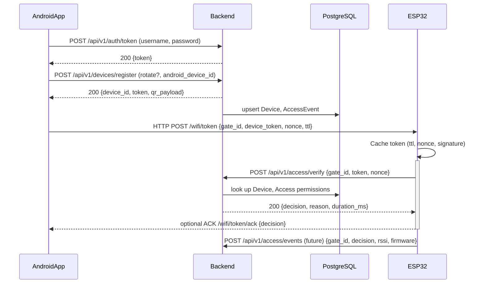

# Wi-Fi Token Flow MVP

## Последовательная диаграмма

## Anti-replay и логирование
- Использовать одноразовый `nonce` и короткий TTL (5–10 сек) для передачи токена через Wi-Fi.
- ESP32 обязан инвалидировать токен после получения `ALLOW/DENY` или по истечении TTL.
- Backend при проверке токена сохраняет `nonce` в `AccessEvent.raw` и отклоняет повторные попытки (потребуется отдельный сторедж или Redis).
- Расширить `AccessEvent` полями `transport`, `firmware_version`, `rssi` для наблюдаемости.

## Чек-лист интеграции — Android
- [ ] Реализовать UI для фонового Wi-Fi обмена с ESP32 (HTTP POST /wifi/token).
- [ ] Хранить `Authorization: Token <api_token>` и ротировать через `/devices/register` при каждом логине.
- [ ] Генерировать `nonce` (UUIDv4) и отправлять TTL, gate_id, device_token.
- [ ] Включить журналирование: success/fail, gate_id, decision.
- [ ] Обрабатывать `RATE_LIMIT` и повторять запрос через backoff.

## Чек-лист интеграции — ESP32
- [ ] HTTP endpoint `/wifi/token` (POST) с полями `gate_id`, `token`, `nonce`, `ttl`.
- [ ] Хранить активный токен в RAM, инвалидировать по TTL или после запроса к backend.
- [ ] Конфигурируемые параметры: backend host/port, verify timeout, retry strategy.
- [ ] Реализовать `POST /api/v1/access/verify` c заголовком `X-Request-ID` и логами `decision/reason`.
- [ ] Добавить диод/реле управления по `decision` и отдавать ACK в Android при успехе/ошибке.
- [ ] При недоступности backend — локальный fail-safe (например, deny + сигнализация).

## Минимальные доработки backend для Wi-Fi MVP
- [ ] Расширить `VerifyRequestSerializer` полями `nonce`, `ttl_ms`, `transport="wifi"`.
- [ ] Проверять одноразовость nonce (Redis или таблица `AccessNonce`).
- [ ] Добавить throttle по ESP32 (`drf` scope `access_verify_wifi`).
- [ ] Логировать `request_id`, `gate_id`, `device_id`, `transport` в structured logs.
- [ ] Подготовить `/api/v1/access/verify/wifi` (опционально) с обязательными контрольными полями.
